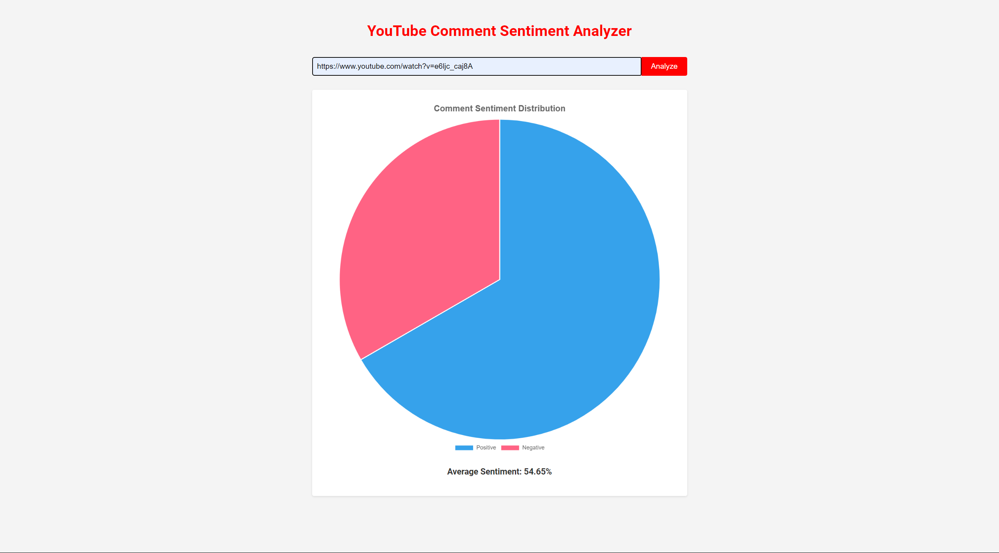

Here's a README template for your project with sections for screenshots:

---

# YouTube Comment Sentiment Analysis

This project is a Flask-based web application that allows users to analyze the sentiment of comments from a YouTube video. By providing the URL of a YouTube video, the application will extract comments, preprocess them, and use a trained machine learning model to determine the sentiment of the comments. The results include the average sentiment, as well as the number of positive and negative comments.

## Features

- Extracts comments from a YouTube video using the YouTube Data API.
- Preprocesses the comments to clean and normalize the text data.
- Uses a trained machine learning model to predict the sentiment of each comment.
- Displays the average sentiment score, along with counts of positive and negative comments.

## Requirements

- Python 3.6+
- Flask
- pandas
- numpy
- scikit-learn
- nltk
- google-api-python-client

## Setup

1. **Clone the repository:**
   ```bash
   git clone https://github.com/yourusername/SentimentAnalyseWithDeployment.git
   cd SentimentAnalyseWithDeployment
   ```

2. **Install dependencies:**
   ```bash
   pip install -r requirements.txt
   ```

3. **Download NLTK data:**
   Run the following commands in a Python shell to download the necessary NLTK data:
   ```python
   import nltk
   nltk.download('stopwords')
   nltk.download('wordnet')
   ```

4. **Set up the API key:**
   Replace the `api_key` in the `analyze_sentiment` function with your actual YouTube Data API key.

5. **Run the application:**
   ```bash
   python app.py
   ```
   The application will start on `http://127.0.0.1:5000/`.

## Usage

1. Open your web browser and navigate to `http://127.0.0.1:5000/`.
2. Enter the URL of a YouTube video in the provided input field.
3. Click on "Analyze" to start the sentiment analysis.
4. The results will be displayed on the page, including the average sentiment score and counts of positive and negative comments.

## Screenshots

1. **Home Page:**
   

2. **Sentiment Analysis Result:**
   

## How It Works

1. **Extract Comments:**
   The `get_youtube_comments` function uses the YouTube Data API to retrieve comments from the specified video. It handles pagination and ensures a specified maximum number of comments are fetched.

2. **Preprocess Comments:**
   The `preprocess_comments` function cleans and normalizes the text data. It removes HTML tags, non-alphabetic characters, and stopwords, and then lemmatizes the words.

3. **Predict Sentiment:**
   The preprocessed comments are transformed using the saved vectorizer and then passed to the machine learning model to predict sentiment probabilities.

4. **Display Results:**
   The results include the average sentiment score, the number of positive and negative comments, and the total number of comments analyzed.

## Future Enhancements

- Improve the model accuracy with more training data and advanced NLP techniques.
- Add more detailed analytics, such as visualizations of sentiment distribution.
- Allow users to upload custom datasets for analysis.

## Contributing

Feel free to submit issues or pull requests if you have suggestions for improving this project.

## License

This project is licensed under the MIT License.

---

You can replace the `screenshots/homepage.png` and `screenshots/analysis_result.png` with the actual file paths to your screenshots.
